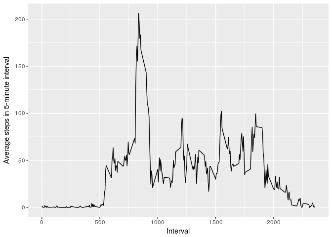

# Reproducible Research: Peer Assessment 1

## Loading and preprocessing the data
Load the motion data taken over 61 days

```r
if(!file.exists("activity.csv")) {
  unzip("activity.zip")
}
data.in <- read.csv("activity.csv", header = TRUE, stringsAsFactors = FALSE)
data.in$date <- as.Date(data.in$date, format = "%Y-%m-%d")
```
## What is mean total number of steps taken per day?
Calculate and make a histogram of steps taken per day

```r
require(ggplot2)
```

```
## Loading required package: ggplot2
```

```r
all.dates <- unique(data.in$date)
all.total.steps <- sapply(all.dates, function(d) sum(data.in$steps[data.in$date == d], na.rm=T))
qplot(all.total.steps, xlab = "Total Steps per Day")
```

```
## `stat_bin()` using `bins = 30`. Pick better value with `binwidth`.
```

<!-- -->

Calculate the mean and median of steps taken per day

```r
mean(all.total.steps)
```

```
## [1] 9354.23
```

```r
median(all.total.steps)
```

```
## [1] 10395
```
## What is the average daily activity pattern?
Calculate the average number of steps in each 5-minute interval of the day

```r
all.intervals <- unique(data.in$interval)
mean.steps.in.interval <- sapply(all.intervals, function(i) mean(data.in$steps[data.in$interval == i], na.rm=T))
qplot(all.intervals, mean.steps.in.interval, geom="line",xlab="Interval", ylab="Average steps in 5-minute interval")
```

<!-- -->

Report the 5-minute interval with the greatest average number of steps

```r
all.intervals[mean.steps.in.interval == max(mean.steps.in.interval)]
```

```
## [1] 835
```

## Imputing missing values
Report the number of step observations with missing data

```r
length(which(is.na(data.in$steps)))
```

```
## [1] 2304
```

To accomodate this missing data, we make a new dataset replacing missing values with the interval's average number of steps

```r
missing.values <- which(is.na(data.in$steps))

data.point.to.fill <- function(index) {
  which.interval <- which(all.intervals == data.in$interval[index])
  mean.steps.in.interval[which.interval]
}

data.to.fill <- sapply(missing.values, data.point.to.fill)
filled.data <- data.in
filled.data$steps[missing.values] <- data.to.fill
```

Verify that there are no longer missing data points

```r
any(is.na(filled.data$steps))
```

```
## [1] FALSE
```

Repeat the previous analysis using the filled in data, with histogram, mean, and median

```r
new.all.total.steps <- sapply(all.dates, function(d) sum(filled.data$steps[filled.data$date == d], na.rm=T))
qplot(new.all.total.steps, xlab = "Total Steps per Day", main = "Using Filled Data")
```

```
## `stat_bin()` using `bins = 30`. Pick better value with `binwidth`.
```

<!-- -->

```r
mean(new.all.total.steps)
```

```
## [1] 10766.19
```

```r
median(new.all.total.steps)
```

```
## [1] 10766.19
```

**Observation:** We can see that the majority of the zero-step days were in fact reflections of missing data. The mean and median are noticeably higher in the filled dataset versus the non-filled, corresponding at least in part to the removal of the false zero-step days. We see that imputing missing data as we have generally increases the average number of steps per day.

## Are there differences in activity patterns between weekdays and weekends?

Create a factor variable with the two levels "weekday" and "weekend"

```r
day.type <- function(day) {
  if(weekdays(day) == "Saturday" || weekdays(day) == "Sunday") {
    "weekend"
  } else {
    "weekday"
  }
}
all.day.types <- factor(sapply(filled.data$date, day.type))
```

Create a panel plot of average number of steps in an interval over weekdays or weekends (using filled data)

```r
interval.mean.by.day.type <- function(i, day.type) {
  mean(filled.data$steps[filled.data$interval == i & all.day.types == day.type], na.rm=T)
}
wkd.mean.steps <- sapply(all.intervals, interval.mean.by.day.type, day.type="weekday")
wke.mean.steps <- sapply(all.intervals, interval.mean.by.day.type, day.type="weekend")

joined.wk.factor <- factor(c(rep("weekday", length(all.intervals)), rep("weekend", length(all.intervals))))

qplot(c(all.intervals,all.intervals), c(wkd.mean.steps, wke.mean.steps), geom="line",xlab="Interval", ylab="Average steps in 5-minute interval", facets = .~joined.wk.factor)
```

<!-- -->
